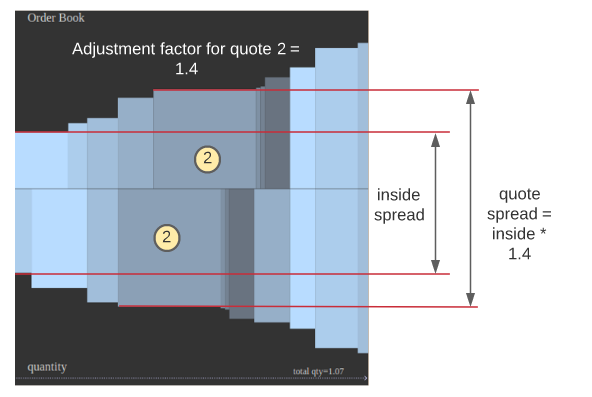

# Microtick Proposal 7: IBC Zone Upgrade

## Purpose

Upgrade Microtick zone to be compatible with IBC and connect to the Osmosis Zone (launching Saturday June 18th) so TICK 
can trade on this new IBC enabled AMM with other IBC enabled assets.

## Description

According to the Microtick community the code is done to enable stargate/IBC compatibility on the microtick zone, the 
community should initiate and enable this upgrade.

Community should then coordinate with the Osmosis zone community to make sure an IBC connection is established between 
Osmosis and Microtick.

Regardless of this proposal's passage, **Microtick the centralized business entity will be ceasing operation of the Ethereum / DAI 
bridge as of July 29th, 2021 (the 1 year anniversary of the microtickzone chain series)**. All MT-DAI currently outstanding on the 
Microtick chain is backed by DAI contained at this Ethereum address: 0x573162B096a2250ba933a6D87457557aDe4F10e7.

## Benefits

IBC compatibility brings many benefits to the Microtick zone and community, including delivering on the promise of IBC 
enabled cosmos zones.

Being able to participate in the Osmosis zone will bring further attention and community development to the Mircotick 
community, as well as allowing TICK to freely trade, allowing further decentralization and distribution as well as the 
ability for interested validators to acquire TICK.  Also, this will enable Microtick to be setup to connect to other IBC 
enabled AMMs such as the Gravity DEX.

## Upgrade Procedure

### 1. Chain Halt

If this proposal passes, the existing chain "microtickzone-a2" will be snapshotted on July 29th, 2021 at 3 pm UTC. After
this cutoff time, validators will be free to stop their nodes.

### 2. Account Balance Import

A new genesis block will be created using the stargate Microtick binary with default parameters.

The state at the **last block with a consensus timestamp prior to the cutoff time** will be used to generate account balances
for chain restart.

Account balances will be imported by script using CLI "mtm add-genesis-account" functionality, using the account balances from the
microtickzone-a2 snapshot at the cutoff time and a script which will be provided.

### 3. Market Import

The names and descriptions of current markets will be imported to the new genesis as well.

### 4. Genesis Time and Chain ID

In addition, the new chain ID and genesis time parameters will be changed to:

genesis_time = "2021-08-02T15:00:00Z"
chain_id = "microtick-1"

### 5. Governance Voting Time

The governance voting time period will be imported to the new genesis as well.

### 6. New Genesis Signing

Validators will sign a new gentx from this new genesis.json and prepare their nodes prior to the chain restart time of August 1, 2021.

### 7. Post-restart Governance

Post-restart, there will be a governance proposal to use cosmos ATOM as the backing token for Microtick. This will require an IBC channel
to be created first in order to determine the IBC denomination in the proposal. Validators should stand by for this vote, post-restart.

## Microtick Stargate - Chain Upgrade Notes

The upcoming Stargate release brings the highly anticipated IBC capabilities to the Microtick chain, and some exciting new features as well.

### IBC Deposits and Withdrawals

With the new Stargate SDK release Microtick now supports token deposits and withdrawals from other chains that also support IBC. Multiple relayers
can relay packets between chains. Gone are the days where a trusted bridge was necessary to transfer backing tokens on- or off-chain.  In addition,
there is no KYC requirement for IBC transfers, or any limitation on the size of deposits or withdrawals.

In addition to backing token transfers over IBC, any Microtick account can now transfer TICK tokens off chain to trade on an Automated Market Maker
or DEX.

### New Governance Features

The chain adds two new governance proposals specific to the x/microtick module: **Backing Denomination** and **Add Markets**.

#### Backing Denomination Proposal

IBC tokens have a naming mechanism based on the port / channel and their denomination on the originating chain. This results in token denominations
on the receiving chains that look like:

```
ibc/ED2456914E48C1E17B7BD922177291EF8B7F553EDF1B1F66B6FC1A076524B22F
```

This mechanism is described in more detail here: https://docs.cosmos.network/master/architecture/adr-001-coin-source-tracing.html

Once a channel has been set up between a source chain and Microtick, the Microtick governance community can switch to a new backing token denomination by 
proposing and passing a **Backing Denom** change proposal. Upon successful passage, the following changes take effect immediately:

- All existing quotes and trades using the previous denomination are closed and removed from the markets.
  - Quote backing is refunded to the quote provider
  - Trade backing is refunded to the short counterparty. No credit is given for an in-the-money consensus.
  - Premium paid is not refunded to the long counterparty (this was paid at trade initiation).
- The new backing denomination is stored in the parameter set and must be used for all quotes, trades and settlements after the backing change.

#### Add Markets Proposal

The community can now dynamically add new markets without having to stop and restart the chain. With a successful vote, the new markets become available 
automatically for trading upon proposal passage. Each market must have a **name** and **description**. No structure or naming convention is enforced by the
governance mechanism itself; proposal curation is assumed to have been provided by the community through the proposal process.

### New Trading Features

#### Option Bids

With the Stargate update, all quotes have implicit bids associated with them where market makers must "buy back" quotes that disagree from the consensus.
The default bid premium is zero, meaning all quotes that are at the consensus price will have bids of zero premium (a riskless trade for the market maker if
someone decides to sell into the quote). As the consensus moves away from the quote's spot, the bid premium adjusts in the same way asks premiums do (with a
linear delta of 0.5).

While the default bid price is zero, market makers can optionally create a quote with a bid greater than zero. Market makers can do this is they want to
buy premium, but not at the ask price on the market.

Because bid premiums do not inherently back quotes, there is no way to create a bid without the associated ask. Bids must always be less than the ask price
of a quote, and quote weights post-Stargate are computed as backing / average premium, where average premium is bid + ask / 2.

#### Synthetic Long / Short Positions

The addition of bids to the marketplace creates the ability for traders to create option combo positions. The most common of these are synthetic long and
short positions. With Microtick Stargate you can now query synthetic prices and trade synthetic positions directly without having to buy / sell the individual
option legs independently.

To query synthetic bids and asks from the CLI:

```
$ mtm query microtick synthetic <market> <duration>
```

Trading a synthetic position is identical to trading an option, but uses the keyword "syn" instead of "call" or "put". The profit / loss of a synthetic
position is identical to buying or selling the underlying asset, over the time duration of the position - except you don't have to pay the strike price.
(You do have to put up token backing for the short leg of the position, which is refunded to you at trade settlement if the trade moves in your direction)

```
$ mtm tx microtick trade <market> <duration> [buy|sell] syn <quantity>
```

### Commission and TICK Rewards

#### Commission Structure

The previous version of Microtick had TICK rewards based directly on the amount of commissions paid. Microtick Stargate calculates TICK rewards based
on the amount of backing for quotes, and based on a fixed rate for trades (default 0).  These are specified in the genesis file and independently 
adjustable through governance. This will allow for much better fine tuning of TICK rewards, similar to the way there are separate commissions for 
various transactions:

| Action | Default Commission | Default TICK Reward | Notes |
| ------ | ------------------ | ------------------- | ----- |
| Create Quote | 0.04% | 200 TICK / unit | Depositing quote backing pays the create commission rate |
| Update Quote | 0.005% | 25 TICK / unit | Maintaining quotes is cheaper than canceling / re-creating |
| Trade | 0.025 (fixed) | 0 | By default 0.025 (fixed) is held in escrow as a trade settlement incentive |
| Settle Trade | 0.01 (fixed) | 0 | |
| Cancel Quote | 0.01% | N/A | Withdrawing quote backing pays the cancel commission rate |

#### Adjustment Factor for Quotes

With Microtick Stargate we introduce the concept of an adjustment factor that is used to dynamically adjust commissions and TICK reward based on how
competitive a quote's premium is in the marketplace.

Every quote placed, updated or deposited (add backing to) is subject to an adjustment factor. This is calculated based on the ratio of the quote's spread
to the inside spread as shown in the diagram below.



In order to pay the base commission amount specified in the genesis file, a quote's spread must be equal to or less than the inside spread (if less, then
the minimum adjustment factor is always 1, or no adjustment)

* Commissions are adjusted up based on the adjustment factor.
* TICK rewards are adjusted down based on the adjustment factor.

In the example in the diagram, if quote 2 were placed on the market with the inside spread as shown, the commission paid would be 1.4 * base commission,
and the TICK reward would be 0.71 * base reward. Therefore, the most competitive quotes on the market will pay the least commission and receive the best
price for TICK rewards.

If market makers see an inside spread that seems too low for market conditions, it will be better in some circumstances to trade the quotes off the market
in order to maintain a fair adjustment factor in the order book.

#### Quote Cancellation Slash Rate

The previous version of Microtick allowed the backing of stale quotes to be claimed by any Quote Cancel transaction. With the Stargate release, quote 
cancellation has a slash rate (default 1%) where the transaction signer claims 1% of the backing and the rest is returned to the quote provider.  This
rate is adjustable through governance.
